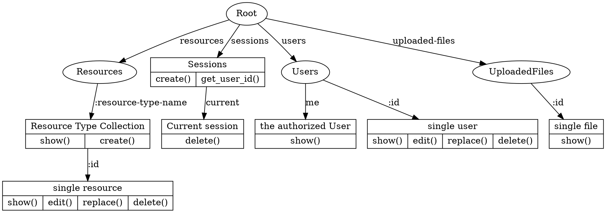
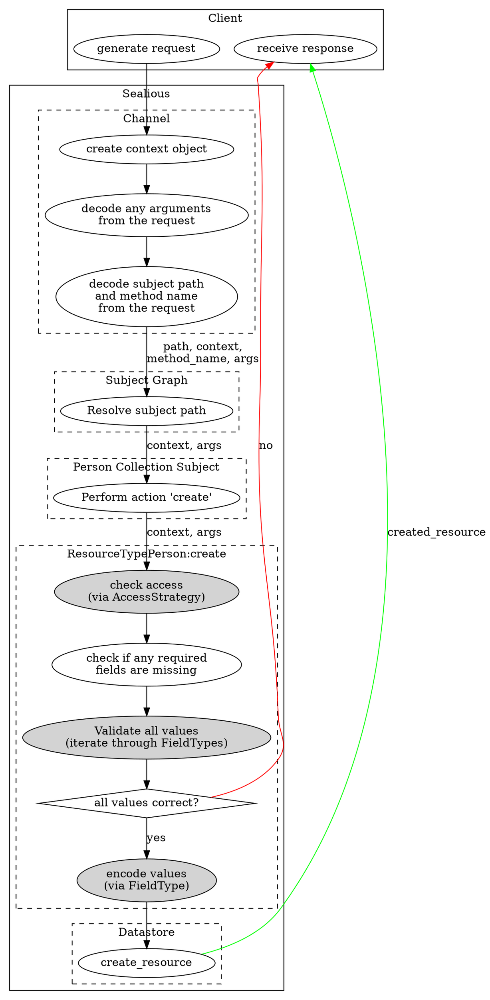

# Sealious User Reference

## Intro

Sealious is a declarative, resource-oriented framework for creating application backends. Although it has been built with webapps in mind, it can be (and successfully has been) used for desktop applications, as well.

### Declarative

When creating a Sealious application, the developer has to focus on the "what" of the application, not the "how". Consider the following Sealious resource-type declaration:

```javascript
var Person = new Sealious.ResourceType({
	name: "people",
	fields: [
		{name: "full-name", type: "text", required: true},
		{name: "age", type: "int"}
	],
	access_strategy: {
		default: "owner",
		view: "public",
		create: "logged_in"
	}	
})
```

That's all Sealious needs to create an API that lets users perform [CRUD](https://en.wikipedia.org/wiki/Create,_read,_update_and_delete) operations on the `people` collection. It will let anyone view the elements of the collection, but only authenticated users will be able to *create* new entries, and only the owner of a given entry would be able to make edits to it. The details and the meaning behind this and other declarations will be explained in the following chapters.

### The Subject Graph

Based on the given declarations, Sealious builds the Subject Graph, which contains methods that can be called by clients.

<div class="wide">

</div>

Note that it does look like a tree in the above example, but certain custom Subjects can redirect to another nodes, possibly creating a cycle.

### Chips

Sealious's structure is highly modular. In fact, one cannot create a functional Sealious application without using at least one module! (Fortunately, Sealious comes with sane default modules to ease development). 

Sealious uses `npm` as a way to distribute it's modules. To distinguish them from regular node modules, Sealious modules from `npm` are called "plugins".

Sealious plugins contain one or more "chips". Chips are small entities that contain a singular purpose. Every chip is one of these types:

* Channel
* ResourceType
* FieldType
* AccessStrategyType
* Datastore
* Subject

#### Channel

A Channel's responsibility is to provide access to some (or all) of the methods from the Subject Tree. It identifies the client and creates a Context object for each of the client's requests. 

Examples: 

* REST, 
* WebSocket.

#### Resource Type

Describes the template for all elements in a Resource Type Collection. Contains *Fields* - each with a *FieldType* assigned.

Examples: 

* Person, 
* User, 
* Animal, 
* Document.

#### Field Type

Describes behavior for a type of a field in a Resource Type: what are the correct values handled by this field? Can be parametrized and inherit from other field types.

Examples:

* text,
* integer,
* color,
* reference.

#### AccessStrategyType

A function of Context. Takes a Context object and decides whether that context meets the arbitrary criteria or not. One AccessStrategyType can be parametrized and instantiated into various AccessStrategy instances.

Exmples: 

* public,
* admin,
* only_logged_in.

#### Datastore

Responsible for storing and querying data.

Examples:

* MongoDB,
* MySQL (possibly in the future).

#### Subject

Creates a node in the Subject Graph. Can expose arbitrary methods.

Examples: 

* Resource Collection,
* Single Resource (identified by its `id`),
* Sessions.

### Context

Whenever a client calls a method through the API generated by Sealious, the Channel through which the request is made is tasked with generating a Context for this request. Context is an object that represent who and when made a given request. It is immutable. It is being passed down to *each* method which is called as a consequence of that given request. Thanks to that [Insecure Direct Object Reference](https://www.owasp.org/index.php/Top_10_2010-A4-Insecure_Direct_Object_References) vulnerabilities are basically impossible by default in a Sealious app.

### Lifespan of a Sealious method call

Here's a lifespan for a "create a resource of type Person" method call.

Assume the following client input:

```json
{
	"path": "/resources/person",
	"method": "create",
	"arguments": {
		"name": "Alice",
		"age": 99
	}
}
```

The exact syntax of a call can be different for each Channel, but essentially it always has to contain the information presented above. The differences between call syntax for Sealious Channels does not fit inside the scope of this reference.



The darker nodes represent functions that are context-sensitive.
