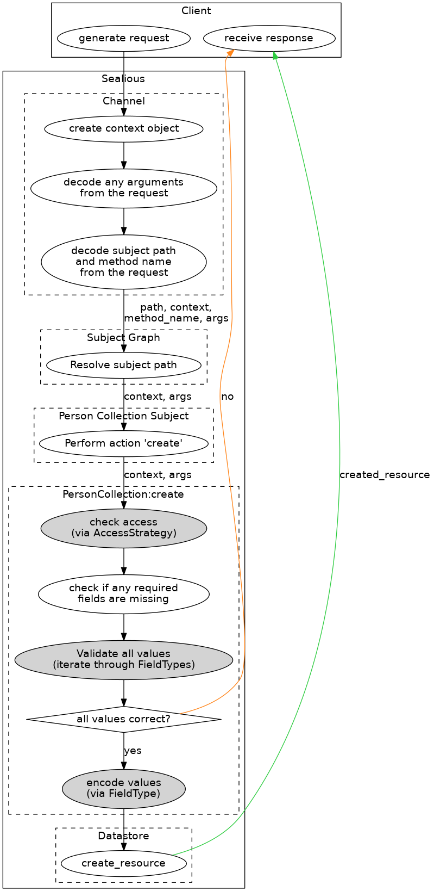

<!-- DON'T EDIT THIS FILE!! This is a file built from the source .md files (see Makefile). The build process will override changes made to this file. Edit other .md files instead. -->


Sealious User Reference
===


[Skip to content >](#content-anchor)

Table of Contents
-----------------
-   [Intro](#intro)
    -   [Declarative](#declarative)
    -   [The Subject Graph](#the-subject-graph)
    -   [Chips](#chips)
        -   [Channel](#channel)
        -   [Resource Type](#resource-type)
        -   [Field Type](#field-type)
        -   [AccessStrategyType](#accessstrategytype)
        -   [Datastore](#datastore)
        -   [Subject](#subject)
    -   [Context](#context)
    -   [Lifespan of a Sealious method call](#lifespan-of-a-sealious-method-call)
-   [Declarations](#declarations)
    -   [Generic types](#generic-types)
    -   [FieldType](#fieldtype)
    -   [Field](#field)
    -   [AccessStrategyType](#accessstrategytype-1)
    -   [AccessStrategy](#accessstrategy)
    -   [ResourceActionName](#resourceactionname)
    -   [Collection](#collection)
-   [Base Chips](#base-chips)
    -   [Access Strategy Types](#access-strategy-types)
        -   [and](#and)
        -   [logged\_in](#logged_in)
        -   [noone](#noone)
        -   [not](#not)
        -   [or](#or)
        -   [owner](#owner)
        -   [public](#public)
        -   [super](#super)
        -   [themselves](#themselves)
    -   [Field Types](#field-types)
        -   [boolean](#boolean)
        -   [color](#color)
        -   [context](#context-1)
        -   [date](#date)
        -   [datetime](#datetime)
        -   [email](#email)
        -   [file](#file)
        -   [float](#float)
        -   [hashed-text](#hashed-text)
        -   [int](#int)
        -   [single\_reference](#single_reference)
        -   [text](#text)
        -   [username](#username)
    -   [Resource Types](#resource-types)
        -   [User](#user)

<h2 id="content-anchor">&nbsp;</h2>

Intro
-----

Sealious is a declarative, resource-oriented framework for creating application backends. Although it has been built with webapps in mind, it can be (and successfully has been) used for desktop applications, as well.

### Declarative

When creating a Sealious application, the developer has to focus on the "what" of the application, not the "how". Consider the following Sealious resource-type declaration:

``` javascript
var Person = new Sealious.Collection({
    name: "people",
    fields: [
        {name: "full-name", type: "text", required: true},
        {name: "age", type: "int"}
    ],
    access_strategy: {
        default: "owner",
        view: "public",
        create: "logged_in"
    }   
})
```

That's all Sealious needs to create an API that lets users perform [CRUD](https://en.wikipedia.org/wiki/Create,_read,_update_and_delete) operations on the `people` collection. It will let anyone view the elements of the collection, but only authenticated users will be able to *create* new entries, and only the owner of a given entry would be able to make edits to it. The details and the meaning behind this and other declarations will be explained in the following chapters.

### The Subject Graph

Based on the given declarations, Sealious builds the Subject Graph, which contains methods that can be called by clients.


Note that it does look like a tree in the above example, but certain custom Subjects can redirect to another nodes, possibly creating a cycle.

### Chips

Sealious's structure is highly modular. In fact, one cannot create a functional Sealious application without using at least one module! (Fortunately, Sealious comes with sane default modules to ease development).

Sealious uses `npm` as a way to distribute it's modules. To distinguish them from regular node modules, Sealious modules from `npm` are called "plugins".

Sealious plugins contain one or more "chips". Chips are small entities that contain a singular purpose. Every chip is one of these types:

-   Channel
-   Collection
-   FieldType
-   AccessStrategyType
-   Datastore
-   Subject

#### Channel

A Channel's responsibility is to provide access to some (or all) of the methods from the Subject Tree. It identifies the client and creates a Context object for each of the client's requests.

Examples:

-   REST,
-   WebSocket.

#### Resource Type

Describes the template for all elements in a Resource Type Collection. Contains *Fields* - each with a *FieldType* assigned.

Examples:

-   Person,
-   User,
-   Animal,
-   Document.

#### Field Type

Describes behavior for a type of a field in a Resource Type: what are the correct values handled by this field? Can be parametrized and inherit from other field types.

Examples:

-   text,
-   integer,
-   color,
-   reference.

#### AccessStrategyType

A function of Context. Takes a Context object and decides whether that context meets the arbitrary criteria or not. One AccessStrategyType can be parametrized and instantiated into various AccessStrategy instances.

Exmples:

-   public,
-   admin,
-   only\_logged\_in.

#### Datastore

Responsible for storing and querying data.

Examples:

-   MongoDB,
-   MySQL (possibly in the future).

#### Subject

Creates a node in the Subject Graph. Can expose arbitrary methods.

Examples:

-   Resource Collection,
-   Single Resource (identified by its `id`),
-   Sessions.

### Context

Whenever a client calls a method through the API generated by Sealious, the Channel through which the request is made is tasked with generating a Context for this request. Context is an object that represent who and when made a given request. It is immutable. It is being passed down to *each* method which is called as a consequence of that given request. Thanks to that [Insecure Direct Object Reference](https://www.owasp.org/index.php/Top_10_2010-A4-Insecure_Direct_Object_References) vulnerabilities are basically impossible by default in a Sealious app.

### Lifespan of a Sealious method call

Here's a lifespan for a "create a resource of type Person" method call.

Assume the following client input:

``` json
{
    "path": "/resources/person",
    "method": "create",
    "arguments": {
        "name": "Alice",
        "age": 99
    }
}
```

The exact syntax of a call can be different for each Channel, but essentially it always has to contain the information presented above. The differences between call syntax for Sealious Channels does not fit inside the scope of this reference.



The darker nodes represent functions that are context-sensitive.

Declarations
------------

Creating a Sealious application consists mainly of composing various declarations and letting Sealious take care of interactions between each one of them. Below are listed and describe all the declaration syntaxes you need to know in order to be a productive Selious developer.

**Note:** we'll be using the [jsig notation](https://github.com/jsigbiz/spec) for describing the various syntaxes.

### Generic types

    type AcceptCallback: () => void;

    type RejectCallback: (errorMessage: String) => void;

    type Params: Object<String, Any>;

### FieldType

-   Syntax

    <pre>
    <code>type FieldType: {
        name?: String,
        is_proper_value: (
            context: Context, 
            params: <a href="#generic-types">Params</a>, 
            new_value: Any,
            old_value?: Any 
        ) =&gt; Promise<reject_reason?: String>,
        encode?: (
            context: Context, 
            params: <a href="#generic-types">Params</a>, 
            value_in_code: Any
        ) =&gt; Promise&lt;encoded_value: Any&gt; & Any,
        decode?: (
            context: Context,
            params: <a href="#generic-types">Params</a>,
            value_in_db: Any
        ) =&gt; Promise&lt;decoded_value: Any&gt; & Any,
        extends?: <a href="#fieldtype">FieldType</a>
    } | FieldTypeName
    </code>
    </pre>

-   Explanation

    You can notice that there are two possible syntaxes (separated above with a `|` character). When creating a new FieldType, one has to describe it's behavior with the former notation. When only referencing an already described FieldType, one can use it's unique name.

    -   `name`: **optional**. The name of the FieldType. Please note that this is the name of the *type* of a field, not a name of a *field*. Has to be unique amongst all other registred FieldTypes. When provided, the FieldType created by this declaration can be referenced with `FieldTypeName`.
    -   `is_proper_value`: a function that takes a value (`new_value`) and decides whether that value is accepted. Can take `old_value` into consideration. `params` are parameters for the particular *field* that uses this field *type*. Should `return Promise.resolve()` to accept, and `return Promise.reject("Reason")` to reject.
    -   `encode`: **optional**. Takes the value for a field from client's input and transforms it into something else. The result of calling that function for the client's input is what will be stored in the database.
    -   `decode`: **optional**. A function reverse to `encode`. If declared, the value in the database will be run through that function before being returned to the client.
    -   `extends`: **optional**. Must be a proper `FieldType` declaration. When specified, the field-type being declared will inherit behavior from the type it is extending. All specified methods will obscure the parent's methods. The unspecified will be inherited.
-   Usage

    To create a new FieldType instance, call the `Sealious.FieldType` constructor.

    ``` javascript
    var my_field_type = new Sealious.FieldType({
        name: "text",
        //...
    });
    ```

-   Example

    ``` javascript
    var Sealious = require("sealious");
    var Promise = require("bluebird");
    var Color = require("color");

    var field_type_color = new Sealious.FieldType({
        name: "color",
        is_proper_value: function(context, params, new_value){
            try {
                if (typeof (new_value) === "string"){
                    Color(new_value.toLowerCase());
                } else {
                    Color(new_value);
                }
            } catch (e){
                return Promise.reject("Value `" + new_value + "` could not be parsed as a color.");
            }
            return Promise.resolve();
        },
        encode: function(context, params, value_in_code){
            var color = Color(value_in_code);
            return color.hexString();
        }
    });
    ```

### Field

Fields are the most important part of a Collection. They describe it's behavior and structure.

-   Syntax

    <pre>
    <code>type Field: {
        type: <a href="#fieldtype">FieldType</a>,
        name: String,
        required?: Boolean,
        params?: <a href="#generic-types">Params</a>
    }</code>
    </pre>

-   Explanation

    -   `type`: required. A FieldType declaration. It's more comfortable to use the "short" FieldType notation here (that is: just entering the name of the registered FieldType).
    -   `name`: the name of the field. Has to be unique within the Collection.
    -   `required`: **optional**. Defaults to `false`. If set to `true`, Sealious won't allow modifications of the resource that would result in removing a value from that field.
    -   `params`: **optional**. A set of parameters that configure the behavior of the FieldType for that particular field.
-   Usage

    Use it when describing a [Collection](#collection).

-   Example

    ``` json
    {"name": "full-name", "type": "text", "required": true}
    ```

### AccessStrategyType

AccessStrategyType describes a type of an access strategy that can be parametrized, instantiated, and, for example, assigned to a Collection.

-   Syntax

    <pre>
    <code>type AccessStrategyType: {
        name?: String,
        checker_function: (
            context: Context,
            params: <a href="#generic-types">Params</a>,
            item?: Any
        ) => Promise<error_message?: String> | Boolean,
        item_sensitive?: Boolean | (params: Any) => (Boolean | Promise)
    } | AccessStrategyName
    </code>
    </pre>

-   Explanation

    -   `name`: **optional**. If specified, the AccessStrategyType will be registered and will be accessible by it's name. Useful when the type is used many times.
    -   `checker_function`: **required**. Takes a `context`, `params`, and decides whether or not to allow access. If access is denied, the function should return `Promise.reject("reason")`. The function can also return `true` and `false` to accept and deny access, respectively. If the access strategy is defined as `item_sensitive`, it will receive a third parameter - an object representing the item to which access is being decided.
    -   `item_sensitive`: **optional**. Default to `false`. If set to `true` (or a resolving function, or a function that returns `true`), the `checker_function` will be provided with the item to which access is decided by the access strategy of this type. Loading the item data might by costly - that's why by default the `checker_function` will not receive it as argument.
-   Usage

    To create a new AccessStrategyType, call the AccessStrategyType constructor:

    ``` javascript
    var new_access_str_type = new Sealious.AccessStrategyType({
        name: "only_on_tuesdays",
        //...
    });
    ```

-   Examples

    -   declaring a new Access Strategy Type

        ``` javascript
        {
            name: "only_on_tuesdays",
            checker_function: function(context, params, item){
                var d = new Date(context.timestamp);
                var wd = d.getDay();
                if(wd == 2){
                    return Promise.resolve();
                }else{
                    return Promise.reject("Come back on a Tuesday!");
                }
            }
        }
        ```

    -   pointing at an already existing Strategy Type

        ``` javascript
        "only_on_tuesdays"
        ```

### AccessStrategy

-   Syntax

    <pre>
    <code>type AccessStrategy: <a href="#accessstrategytype-1">AccessStrategyType</a>
        | [type: <a href="#accessstrategytype-1">AccessStrategyType</a>, params:Any]
    </code>
    </pre>

-   Explanation

    If the shorter notation is used (`AccessStrategyType`), you cannot specify any parameters to the AccessStrategyType assigned to that particular Access strategy. If you need to customize the behavior of the AccessStrategyType for that particular AccessStrategy, you have to use the longer syntax (`[type: AccessStrategyType, params:Any]`).

-   Usage

    Currently this declaration is only being used when describing access strategies to resource actions in [Collection](#collection) declaration.

-   Examples

    -   `"only_on_tuesdays"`
    -   `"logged_in"`
    -   `["and", ["only_on_tuesdays", "logged_in"]]`

### ResourceActionName

-   Syntax

        type ResourceActionName: "default" | "create" | "retrieve" | "update" | "delete"

-   Usage

    It does not have it's own constructor, as it doesn't do anything by itself. It can be used when describing access strategies in [Collection](#collection) declaration.

### Collection

-   Syntax

    <pre>
    <code>type Collection: {
        name: String,
        fields: Array&lt;<a href="#field">Field</a>&gt;,
        access_strategy: <a href="#accessstrategy">AccessStrategy</a> | Object&lt;<a href="#resourceactionname">ResourceActionName</a>, <a href="#accessstrategy">AccessStrategy</a>&gt;
    }
    </code>
    </pre>


-   Explanation

    -   `name`: **required**. The name of the resource-type.
    -   `fields`: **required**. An array of [Fields](#field) declarations.
    -   `access_strategy`: **required**. Describes what access strategies will be used for granting access to calling various resource actions. When a single [AccessStrategy](#accessstrategy) is specified, it will be used for all of the actions. If the `Object<ResourceActionName, AccessStrategy>` notation is being used, then each action can have a different access\_strategy assigned. If an action does not have an AccessStrategy assigned, it will use the `default` one.
-   Usage

    To create a new Collection, call the `Collection` constructor:

    ``` javascript
    var Person = new Sealious.Collection({
        name: "person",
        fields: //...
    });
    ```

-   Examples

    ``` javascript
    {
        name: "person",
        fields: [
            {name: "full-name", type: "text", required: true},
            {name: "age", type: "int"}
        ],
        access_strategy: {
            default: "owner",
            view: "public",
            create: "logged_in"
        }   
    }
    ```

Base Chips
----------

"Base chips" are chips that come bundled with Sealious and don't require separate installation.

### Access Strategy Types

#### and

`and` access strategy type combines multiple access strategies into one. It resolves only if all of the access strategies provided in its `params` resolve, and it rejects otherwise.

##### Sensitivity

It is sensitive to the `context` and/or `item`- depending on the strategies in `params`.

##### Params synopsis

<pre>
<code>type and_params: Array&lt;<a href="#accessstrategy">AccessStrategy</a>&gt;</code>
</pre>

##### Example instance declaration

``` javascript
["and", ["logged_in", "only_on_tuesdays"]]
```

#### logged\_in

Resolves when the user\_id in the provided context is set (not `null`), rejects otherwise.

-   Sensitivity

    It is only sensitive to the `context` argument.

-   Params synopsis

    This Access Strategy Type does not take any parameters.

-   Example instance declaration

    ``` javascript
    "logged_in"
    ```

#### noone

Always rejects.

-   Sensitivity

    sensitive to nothing. Always rejects.

-   Params synopsis

    This Access Strategy Type does not take any parameters.

-   Example instance declaration

    ``` javascript
    "noone"
    ```

#### not

Takes an Access Strategy as an argument. Resolves if the strategy in the `params` rejects. Rejects if the strategy in the params resolves.

-   Sensitivity

    It is sensitive to the `context` and/or `item`- depending on the strategy in `params`.

-   Params synopsis

    <pre>
    <code>type not_params: <a href="#accessstrategy">AccessStrategy</a></code>
    </pre>

-   Example instance declaration

    ``` javascript
    ["not", "logged_in"]
    ```

    ``` javascript
    ["not", ["and", ["logged_in", "owner"]]]
    ```

#### or

Similarly to the [and](#and) access strategy type, this strategy type takes a list of [AccessStrategies](#accessstrategy) as the only parameter. It resolves iff one of the strategies on the list resolves.

-   Sensitivity

    It is sensitive to the `context` and/or `item`- depending on the strategies in `params`.

-   Params synopsis

    <pre>
    <code>type or_params: Array&lt;<a href="#accessstrategy">AccessStrategy</a>&gt;</code>
    </pre>

-   Example instance declaration

    ``` javascript
    ["or", ["owner", "admin"]]
    ```

#### owner

Resolves only if the `user_id` in the provided context matches the `user_id` in the `created_context` attribute of the given `item`.

-   Sensitivity

    It is sensitive to the `context` *and* to the `item` arguments.

-   Params synopsis

    This Access Strategy Type does not take any parameters.

-   Example instance declaration

    ``` javascript
    "owner"
    ```

#### public

Always resolves.

-   Sensitivity

    Sensitive to nothing. Resolves for any given arguments.

-   Params synopsis

    This Access Strategy Type does not take any parameters.

-   Example instance declaration

    ``` javascript
    "public"
    ```

#### super

Resolves only if the provided Context is an instance of SuperContext.

-   Sensitivity

    It is sensitive to the `context` argument only.

-   Params synopsis

    This Access Strategy Type does not take any parameters.

-   Example instance declaration

    ``` javascript
    "super"
    ```

#### themselves

Resolves only if the `user_id` in the `context` argument matches the `id` attribute of the `item` argument.

Useful for creating access strategies for the `User` Collection.

-   Sensitivity

    It is sensitive to the `context` *and* to the `item` arguments.

-   Params synopsis

    This Access Strategy Type does not take any parameters.

-   Example instance declaration

    ``` javascript
    "themselves"
    ```

### Field Types

#### boolean

Stores a true/false value.

-   **acceptable values**:

    This field type tries really hard to understand vast amount of ways one can want to represent a boolean value, including:

    -   a `boolean` value: `true`, `false`;
    -   a string: `"1"`, `"0"`, `"true"`, `"false"`, `"True"`, `"False"`;
    -   a number: `1`, `0`.
-   **sensitivity**

    This field type is only sensitive to the provided `value`.

-   **storage format**

    Whatever the input value, the value stored in the database is going to be a Boolean.

#### color

Stores a color value

-   **acceptable values**:

    This field will accept any format that's acceptable in CSS, including:

    -   rgb: `rgb(255, 255, 255)`;
    -   hsl: `hsl(0, 0%, 100%)`;
    -   hex: `#fffff`.
-   **sensitivity**

    This field type is only sensitive to the provided `value`.

-   **storage format**

    The colors are stored in the database as strings containing hex color representation.

#### context

Stores a context. Used internally to store the context of the last login of a particular user.

-   **acceptable values**:

    This field will only accept objects that are an instance of `Context`

-   **sensitivity**

    This field type is only sensitive to the provided `context`.

-   **storage format**:

    Values for this field type will be stored as an object.

#### date

Used for storing dates, without information on time of day. See also: [datetime](#datetime).

-   **acceptable values**:

    Accepts all dates in ISO standard 8601, that is: `YYYY-MM-DD`.

    Examples:

    -   `"2016-07-04"`
    -   `"1999-12-31"`
-   **sensitivity**

    This field type is only sensitive to the provided `value`.

-   **storage format**:

    The values are stored verbatim as strings

#### datetime

Stores timestamps in the form of milliseconds passed since the [Epoch](since%20UNIX%20Epoch). This time format was chosen to mitigate timezone issues.

-   **acceptable values**:

    Any (positive or negative) Number value is accepted.

    Examples:

    -   `1467645583744` represents `2016-07-04T15:19:43.744Z`
    -   `0` represents `1970-01-01T00:00:00.000Z`
    -   `-1467645583744` represents `1923-06-30T08:40:16.256Z`
-   **sensitivity**

    This field type is only sensitive to the provided `value`.

-   **storage format**

    Values for this field type are kept verbatim as numbers in the datastore.

#### email

Stores a proper email address.

-   **acceptable values**:

    Accepts email addresses that match the following regular expression:

    ``` regexp
    /^(([^<>()[\]\\.,;:\s@\"]+(\.[^<>()[\]\\.,;:\s@\"]+)*)|(\".+\"))@((\[[0-9]{1,3}\.[0-9]{1,3}\.[0-9]{1,3}\.[0-9]{1,3}\])|(([a-zA-Z\-0-9]+\.)+[a-zA-Z]{2,}))$/
    ```

    Example:

    -   `john@example.com`
-   **sensitivity**

    This field type is only sensitive to the provided `value`.

-   **storage format**

    Values for this field type are kept verbatim as strings.

#### file

Stores a binary file.

**Note**: the files are stored in the `uploaded_files` directory, located next to your app's `index.js` file.

-   **acceptable values**

    This field accepts only objects that are an instance of `Sealious.File` as it's `value` parameter.

    Example:

    ``` javascript
    var context = new Sealious.Context();
    var buffer = fs.readFile("photo.jpg");
    var file = new Sealious.File(context, "photo.jpg", buffer);
    ```

-   **sensitivity**

    This field-type's behavior depends only on the provided `value`s.

-   **storage format**

    The uploaded files are stored in the `uploaded_files` directory, located next to your app's `index.js` file. The files have randomly generated names, and have no extension.

    In the datastore they are represented as entries taking the form of:

    ``` json
    {
        "id": "the_random_id",
        "filename": "the_original_filename"
    }
    ```

#### float

Stores any real number.

-   **acceptable values**:

    Accepts any number. Interprets `.` as the decimal separator.

    Examples:

    -   `2`,
    -   `3.141592654`,
    -   `-35432432132124123`
-   **sensitivity**

    This field type's behavior depends only on the provided `value`s.

-   **storage format**

    The values are stored in the datastore as verbatim real numbers (floats).

#### hashed-text

Extends the [text](#text) field-type. Takes any text, and if it meets the criteria specified in the field's params, hashes it with the [RFC 2898](https://tools.ietf.org/html/rfc2898)-recommended PBKDF2 algorithm.

-   **params synopsis**

        type hashed_text_params: {
            required_digits?: Number,
            required_capitals?: Number, 
            hide_hash?: Boolean

    -   `required_digits`: **optional**. If specified, the `value` will not be accepted if it doesn't contain at least that many digits.
    -   `required_capitals`: **optional**. If specified, the `value` will not be accepted if it doesn't contain at least that many capitals.
    -   `hide_hash`: **optional**. If set to `true`, the hash value will be hidden (the value for the field will be `null`). Useful for password fields.

    Also, all of the params from the [text](#text) field-type apply.

-   **acceptable values**

    Any string that matches the requirements specified in the `params`.

-   **storage format**

    The values are stored as a string containing the PBKDF2 hash of the input. There's no practical way to get back the original input.

#### int

Accepts only integer numbers (positive or negative).

-   **sensitivity**

    Sensitive only to the provided `value`.

-   **params synopsis**

    This field type does not take any params.

-   **acceptable values**

    Any integer number, or a string representation of an integer number.

    Examples:

    -   `1`, `11`, `123`
    -   `-2`, `0`;

    Will not accept non-integer numbers.

-   **storage format**

    The values are stored verbatim as Numbers in the datastore.

#### single\_reference

Can reference any other resource.

-   **params synopsis**

    ``` javascript
    type single_reference_params: {
        collection: CollectionDeclaration
    }
    ```

    -   `collection`: **required**. Only references to resources of that particular type will be accepted.
-   **sensitivity**

    The behavior of this resource type depends on `context`, `params` and `value`.

-   **acceptable values**

    Accepts only IDs of existing resources of the type specified in the `params`.

    Example: `qytmp7waxm`

-   **storage format**

    The input values are stored as strings containing the referenced resource's ID.

#### text

Used for storing text.

-   **params synopsis**

        type text_params: {
            max_length?: Number,
            min_length?: Number,
            include_in_search?: Boolean,
            strip_html?: Boolean
        }

    Explanation:

    -   `max_length`: **optional**. If specified, all text with char count higher than that will be rejected with an appropriate error message.
    -   `min_length`: **optional**. If specified, all text with char count lower than that will be rejected with an appropriate error message.
    -   `include_in_search`: **optional**. Defaults to `false`. If set to `true`, the datastore will be instructed to create a full-text index on contents of the field.
    -   `strip_html`: **optional**. Defaults to `false`. If set to `true`, all of the html tags contained in user input will be irreversibly removed.
-   **sensitivity**

    The behavior of this field type depends on provided `value` and `params`.

-   **acceptable values**

    Will accept all strings that meets the criteria contained in `params`.

-   **storage format**

    The text will be stored as a string in the datastore. In certain cases the stored text might be modified before saving (e.G. when HTML sanitization is enabled)

#### username

Extends the [text](#text) field-type.

-   **acceptable values**

    Accepts only strings that are not already used as a username, and which are neither of: `"me"`, `"myself"`, `"current"`.

-   **Sensitivity**

    Things that can influence the behavior of fields of this type:

    -   `value`
    -   the state of the datastore (existing usernames)
    -   `params`
-   **params synopsis**

    See params for the [text](#text) field type.

-   **storage format**

    See: [text](#text) field type.

### Resource Types

#### User

The default field in the User resource type are:

-   username (type: [username](#username)), required;
-   email (type: [email](#email))
-   password (type: [hashed-text](#hashed-text)), required. Min-length: 6.
-   last\_login\_context (type: [context](#context))

By default, anyone can register (create a user), but only the user itself can edit or delete the account.
