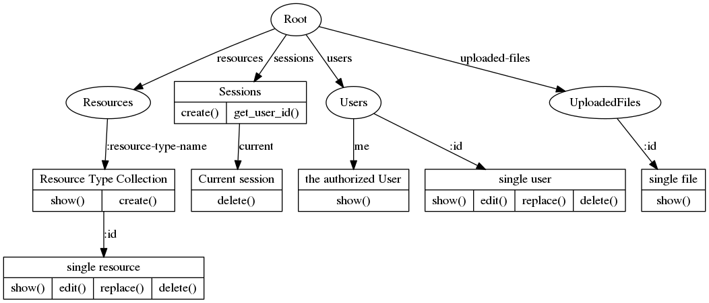
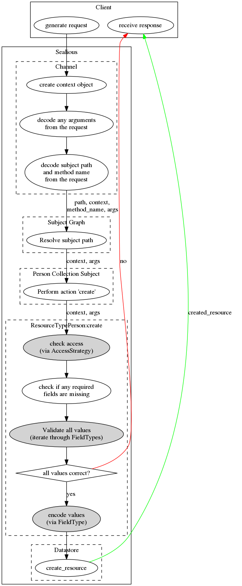

<!-- DON'T EDIT THIS FILE! This is a file built from the source .md files (see Makefile). The build process will override changes made to this file. Edit other .md files instead. -->


Sealious User Reference
=======================

Intro
-----

Sealious is a declarative, resource-oriented framework for creating
application backends. Although it has been built with webapps in mind,
it can be (and successfully has been) used for desktop applications, as
well.

### Declarative

When creating a Sealious application, the developer has to focus on the
"what" of the application, not the "how". Consider the following
Sealious resource-type declaration:

``` {.javascript}
var Person = new Sealious.ResourceType({
    name: "people",
    fields: [
        {name: "full-name", type: "text", required: true},
        {name: "age", type: "int"}
    ],
    access_strategy: {
        default: "owner",
        view: "public",
        create: "logged_in"
    }   
})
```

That's all Sealious needs to create an API that lets users perform
[CRUD](https://en.wikipedia.org/wiki/Create,_read,_update_and_delete)
operations on the `people` collection. It will let anyone view the
elements of the collection, but only authenticated users will be able to
*create* new entries, and only the owner of a given entry would be able
to make edits to it. The details and the meaning behind this and other
declarations will be explained in the following chapters.

### The Subject Graph

Based on the given declarations, Sealious builds the Subject Graph,
which contains methods that can be called by clients.




</div>

Note that it does look like a tree in the above example, but certain
custom Subjects can redirect to another nodes, possibly creating a
cycle.

### Chips

Sealious's structure is highly modular. In fact, one cannot create a
functional Sealious application without using at least one module!
(Fortunately, Sealious comes with sane default modules to ease
development).

Sealious uses `npm` as a way to distribute it's modules. To distinguish
them from regular node modules, Sealious modules from `npm` are called
"plugins".

Sealious plugins contain one or more "chips". Chips are small entities
that contain a singular purpose. Every chip is one of these types:

-   Channel
-   ResourceType
-   FieldType
-   AccessStrategyType
-   Datastore
-   Subject

#### Channel

A Channel's responsibility is to provide access to some (or all) of the
methods from the Subject Tree. It identifies the client and creates a
Context object for each of the client's requests.

Examples:

-   REST,
-   WebSocket.

#### Resource Type

Describes the template for all elements in a Resource Type Collection.
Contains *Fields* - each with a *FieldType* assigned.

Examples:

-   Person,
-   User,
-   Animal,
-   Document.

#### Field Type

Describes behavior for a type of a field in a Resource Type: what are
the correct values handled by this field? Can be parametrized and
inherit from other field types.

Examples:

-   text,
-   integer,
-   color,
-   reference.

#### AccessStrategyType

A function of Context. Takes a Context object and decides whether that
context meets the arbitrary criteria or not. One AccessStrategyType can
be parametrized and instantiated into various AccessStrategy instances.

Exmples:

-   public,
-   admin,
-   only\_logged\_in.

#### Datastore

Responsible for storing and querying data.

Examples:

-   MongoDB,
-   MySQL (possibly in the future).

#### Subject

Creates a node in the Subject Graph. Can expose arbitrary methods.

Examples:

-   Resource Collection,
-   Single Resource (identified by its `id`),
-   Sessions.

### Context

Whenever a client calls a method through the API generated by Sealious,
the Channel through which the request is made is tasked with generating
a Context for this request. Context is an object that represent who and
when made a given request. It is immutable. It is being passed down to
*each* method which is called as a consequence of that given request.
Thanks to that [Insecure Direct Object
Reference](https://www.owasp.org/index.php/Top_10_2010-A4-Insecure_Direct_Object_References)
vulnerabilities are basically impossible by default in a Sealious app.

### Lifespan of a Sealious method call

Here's a lifespan for a "create a resource of type Person" method call.

Assume the following client input:

``` {.json}
{
    "path": "/resources/person",
    "method": "create",
    "arguments": {
        "name": "Alice",
        "age": 99
    }
}
```

The exact syntax of a call can be different for each Channel, but
essentially it always has to contain the information presented above.
The differences between call syntax for Sealious Channels does not fit
inside the scope of this reference.



The darker nodes represent functions that are context-sensitive.

Declarations
------------

Creating a Sealious application consists mainly of composing various
declarations and letting Sealious take care of interactions between each
one of them. Below are listed and describe all the declaration syntaxes
you need to know in order to be a productive Selious developer.

Note: we'll be using the [jsig
notation](https://github.com/jsigbiz/spec) for describing the various
syntaxes.

### Generic types

    type AcceptCallback: () => void;

    type RejectCallback: (errorMessage: String) => void;

    type Params: Object<String, Any>;

### FieldType

#### Syntax

<pre>
<code>type FieldType: {
    name?: String,
    is_proper_value: (
        accept: <a href="#generic-types">AcceptCallback</a>, 
        reject: <a href="#generic-types">RejectCallback</a>, 
        context: Context, 
        params: <a href="#generic-types">Params</a>, 
        new_value: Any,
        old_value?: Any 
    ) => void,
    encode?: (
        context: Context, 
        params: <a href="#generic-types">Params</a>, 
        value_in_code: Any
    ) => Promise<encoded_value: Any> & Any,
    decode?: (
        context: Context,
        params: <a href="#generic-types">Params</a>,
        value_in_db: Any
    ) => Promise<decoded_value: Any> & Any,
    extends?: <a href="#fieldtype">FieldType</a>
} | FieldTypeName
</code></pre>
#### Explanation

You can notice that there are two possible syntaxes (separated above
with a `|` character). When creating a new FieldType, one has to
describe it's behavior with the former notation. When only referencing
an already described FieldType, one can use it's unique name.

-   `name`: **optional**. The name of the FieldType. Please note that
    this is the name of the *type* of a field, not a name of a *field*.
    Has to be unique amongst all other registred FieldTypes. When
    provided, the FieldType created by this declaration can be
    referenced with `FieldTypeName`.
-   `is_proper_value`: a function that takes a value (`new_value`) and
    decides whether that value is accepted. Can take `old_value`
    into consideration. `params` are parameters for the particular
    *field* that uses this field *type*.
-   `encode`: **optional**. Takes the value for a field from client's
    input and transforms it into something else. The result of calling
    that function for the client's input is what will be stored in
    the database.
-   `decode`: **optional**. A function reverse to `encode`. If declared,
    the value in the database will be run through that function before
    being returned to the client.
-   `extends`: **optional**. Must be a proper `FieldType` declaration.
    When specified, the field-type being declared will inherit behavior
    from the type it is extending. All specified methods will obscure
    the parent's methods. The unspecified will be inherited.

#### Usage

To create a new FieldType instance, call the `Sealious.FieldType`
constructor.

``` {.javascript}
var my_field_type = new Sealious.FieldType({
    name: "text",
    //...
});
```

#### Example


``` {.javascript}
var Sealious = require("sealious");
var Promise = require("bluebird");
var Color = require("color");

var field_type_color = new Sealious.ChipTypes.FieldType({
    name: "color",
    is_proper_value: function(accept, reject, context, params, new_value){
        try {
            if (typeof (new_value) === "string"){
                Color(new_value.toLowerCase());
            } else {
                Color(new_value);
            }
        } catch (e){
            reject("Value `" + new_value + "` could not be parsed as a color.");
        }
        accept();
    },
    encode: function(context, params, value_in_code){
        var color = Color(value_in_code);
        return color.hexString();
    }
});
```

</div>

### Field

Fields are the most important part of a ResourceType. They describe it's
behavior and structure.

#### Syntax

<pre>
<code>type Field: {
    type: <a href="#fieldtype">FieldType</a>,
    name: String,
    required?: Boolean,
    params?: <a href="#generic-types">Params</a>
}</code></pre>
#### Explanation

-   `type`: required. A FieldType declaration. It's more comfortable to
    use the "short" FieldType notation here (that is: just entering the
    name of the registered FieldType).
-   `name`: the name of the field. Has to be unique within
    the ResourceType.
-   `required`: **optional**. Defaults to `false`. If set to `true`,
    Sealious won't allow modifications of the resource that would result
    in removing a value from that field.
-   `params`: **optional**. A set of parameters that configure the
    behavior of the FieldType for that particular field.

#### Usage

Use it when describing a [ResourceType](#resourcetype).

#### Example

``` {.json}
{name: "full-name", type: "text", required: true}
```

### AccessStrategyType

AccessStrategyType describes a type of an access strategy that can be
parametrized, instantiated, and, for example, assigned to a
ResourceType.

#### Syntax

<pre>
<code>type AccessStrategyType: {
    name?: String,
    checker_function: (
        context: Context,
        params: <a href="#generic-types">Params</a>,
        item?: Any
    ) => Promise<error_message?: String>
} | AccessStrategyName
</code></pre>
#### Explanation

-   `name`: **optional**. If specified, the AccessStrategyType will be
    registered and will be accessible by it's name. Useful when the type
    is used many times.
-   `checker_function`: **required**. Takes a `context`, `params`, and
    decides whether or not to allow access. If access is denied, the
    function should return `Promise.reject("reason")`.

#### Usage

To create a new AccessStrategyType, call the AccessStrategyType
constructor:

``` {.javascript}
var new_access_str_type = new Sealious.AccessStrategyType({
    name: "only_on_tuesdays",
    //...
});
```

#### Examples

``` {.javascript}
{
    name: "only_on_tuesdays",
    checker_function: function(context, params, item){
        var d = new Date(context.timestamp);
        var wd = d.getDay();
        if(wd == 2){
            return Promise.resolve();
        }else{
            return Promise.reject("Come back on a Tuesday!");
        }
    }
}
```

 

    "only_on_tuesdays"

### AccessStrategy

#### Syntax

<pre>
<code>type AccessStrategy: <a href="#accessstrategytype-1">AccessStrategyType</a>
    | [type: <a href="#accessstrategytype-1">AccessStrategyType</a>, params:Any]
</code></pre>
#### Explanation

If the shorter notation is used(`AccessStrategyType`), you cannot
specify any parameters to the AccessStrategyType assigned to that
particular Access strategy. If you need to customize the behavior of the
AccessStrategyType for that particular AccessStrategy, you have to use
the longer syntax (`[type: AccessStrategyType, params:Any]`).

#### Usage

Currently this declaration is only being used when describing access
strategies to resource actions in [ResourceType](#resourcetype)
declaration.

#### Examples

-   `"only_on_tuesdays"`
-   `"logged_in"`
-   `["and", ["only_on_tuesdays", "logged_in"]]`

### ResourceActionName

#### Syntax


    type ResourceActionName: "default" | "create" | "retrieve" | "update" | "delete"

</div>

#### Usage

It does not have it's own constructor, as it doesn't do anything by
itself. It can be used when describing access strategies in
[ResourceType](#resourcetype) declaration.

### ResourceType

#### Syntax


<pre>
<code>type ResourceType: {
    name: String,
    fields: Array&lt;<a href="#field">Field</a>&gt;,
    access_strategy: <a href="#accessstrategy">AccessStrategy</a> | Object&lt;<a href="#resourceactionname">ResourceActionName</a>, <a href="#accessstrategy">AccessStrategy</a>&gt;
}
</code></pre>

</div>

#### Explanation

-   `name`: **required**. The name of the resource-type.
-   `fields`: **required**. An array of [Fields](#field) declarations.
-   `access_strategy`: **required**. Describes what access strategies
    will be used for granting access to calling various
    resource actions. When a single [AccessStrategy](#accessstrategy) is
    specified, it will be used for all of the actions. If the
    `Object<ResourceActionName, AccessStrategy>` notation is being used,
    then each action can have a different access\_strategy assigned. If
    an action does not have an AccessStrategy assigned, it will use the
    `default` one.

#### Usage

To create a new ResourceType, call the `ResourceType` constructor:

``` {.javascript}
var Person = new Sealious.ResourceType({
    name: "person",
    fields: //...
});
```

#### Examples

``` {.javascript}
{
    name: "person",
    fields: [
        {name: "full-name", type: "text", required: true},
        {name: "age", type: "int"}
    ],
    access_strategy: {
        default: "owner",
        view: "public",
        create: "logged_in"
    }   
}
```
